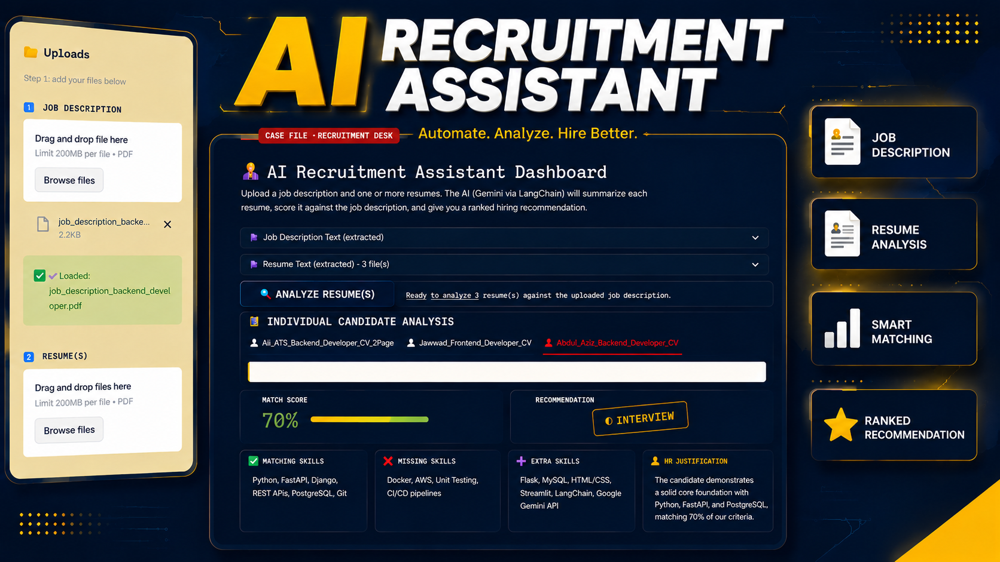

# 🧑‍💼 AI Recruitment Assistant Dashboard

An AI-powered HR tool built with **Streamlit + LangChain + Google Gemini**.

Upload a Job Description and one or more resumes (PDF), and the app will:

- 📝 Summarize each resume (education, experience, skills)
- 🎯 Compare resume skills against the job description (Matching / Missing / Extra)
- 📊 Give a Match Score (0–100%)
- ✅ Give a hiring Recommendation (Hire / Interview / Reject) with justification
- 🎤 Generate tailored interview questions
- 🏆 Rank all candidates in one comparison table
- ⬇️ Export the ranking as CSV

---

## 🎬 Demo Video

Watch the full walkthrough here: **[AI Recruitment Assistant — Demo](https://youtu.be/jnQAlJi4t7k?si=Z_OsWCvCmUZRIU1C)**

[](https://youtu.be/jnQAlJi4t7k?si=Z_OsWCvCmUZRIU1C)

---

## 🧠 How it works (Architecture)

```
HR Dashboard (Streamlit)
        │
        ▼
Upload Resume(s) + Job Description (PDF)
        │
        ▼
PDF Text Extraction (pypdf)
        │
        ▼
Text Cleaning
        │
        ▼
LangChain Pipeline (Google Gemini)
   ├── Chain 1: Resume Summary
   ├── Chain 2: Skill Matching
   ├── Chain 3: Match Score
   ├── Chain 4: HR Recommendation
   └── Chain 5: Interview Questions
        │
        ▼
Ranking Table + CSV Export
```

---

## 📁 Project Structure

```
AI-Recruitment-Assistant/
│
├── app.py                     # Main Streamlit app
├── requirements.txt
├── .env.example                # Copy to .env and add your Gemini API key
│
├── components/
│   ├── sidebar.py              # Upload UI (Module 1)
│   ├── uploader.py             # PDF -> text pipeline (Module 2)
│   └── ranking.py               # Ranking table + CSV export (Modules 10-11)
│
├── utils/
│   ├── pdf_reader.py            # PDF text extraction + cleaning
│   ├── prompts.py                # All LangChain prompt templates
│   └── parser.py                 # Robust JSON parsing for LLM output
│
├── ai/
│   ├── llm.py                    # Gemini model setup
│   └── chains.py                  # The 5-chain LangChain pipeline
│
├── data/                          # Sample resumes + job descriptions (PDF)
│
└── outputs/                        # (CSV exports land here if run manually)
```

---

## 🚀 Quick Start

### 1. Install Python

You need **Python 3.10+** installed. Check with:

```bash
python3 --version
```

### 2. Install dependencies

From inside the `AI-Recruitment-Assistant` folder:

```bash
pip install -r requirements.txt
```

### 3. Add your Gemini API key

1. Get a free API key from **[Google AI Studio](https://aistudio.google.com/app/apikey)**.
2. Open `.env` and paste your key:

```
GOOGLE_API_KEY=your_actual_key_here
```

### 4. Run the app

```bash
streamlit run app.py
```

Your browser will open automatically at `http://localhost:8501`.

### 5. Use it

1. Upload a Job Description PDF in the sidebar.
2. Upload one or more Resume PDFs in the sidebar.
3. Click **"Analyze Resume(s)"**.
4. Review each candidate's tab, then check the **Candidate Ranking** table at the bottom.
5. Click **"Export Ranking as CSV"** to download results.

> 💡 Sample PDFs (5 resumes + 2 job descriptions) are already provided in the `data/` folder — use these to test the app immediately without needing your own files.

---

## 🛠️ Troubleshooting

| Problem | Fix |
|---|---|
| `GOOGLE_API_KEY is missing` error | Make sure you created `.env` (not `.env.example`) and pasted a real key with no quotes. |
| `model not found` / 404 error | Google regularly retires old Gemini model versions. Open `.env` and make sure `GEMINI_MODEL` is either `gemini-flash-latest` (recommended, auto-updates) or a currently valid name from https://ai.google.dev/gemini-api/docs/models. |
| App won't start / `ModuleNotFoundError` | Run `pip install -r requirements.txt` again inside the correct Python environment. |
| Analyze button is disabled | You must upload BOTH a Job Description and at least one Resume first. |
| Slow analysis with many resumes | Each resume runs 5 AI calls sequentially — this is expected. For 5 resumes, allow ~1-2 minutes. |

---

## 🔮 Future Enhancements (ideas, not yet built)

- Radar chart comparing candidates across Skills / Experience / Education / Projects
- Expandable candidate cards
- "Chat with Resume" using RAG
- Voice summary via text-to-speech
- Auto-generated interview invite / rejection emails
- Login / authentication for HR users
- Database storage (SQLite / PostgreSQL) for analysis history

---
## 👤 Author

**Made by Muhammad Abdul Aziz**
